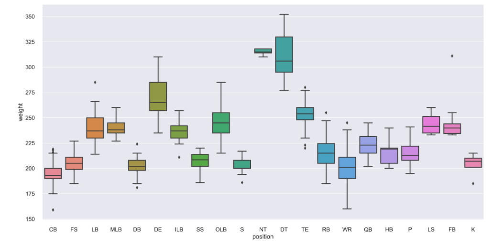
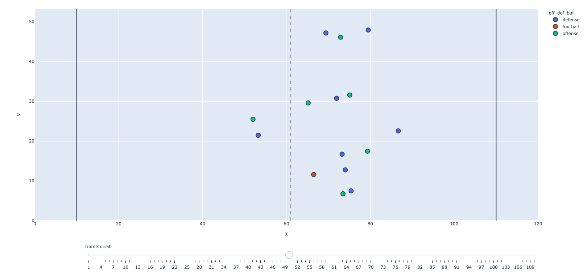
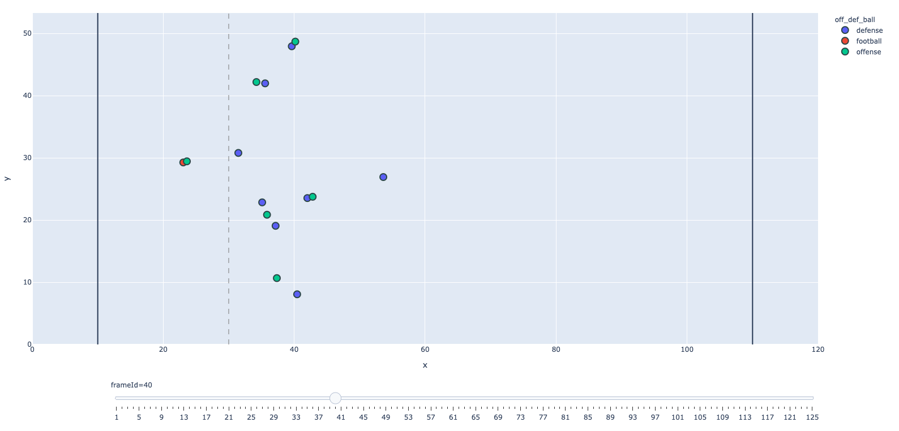
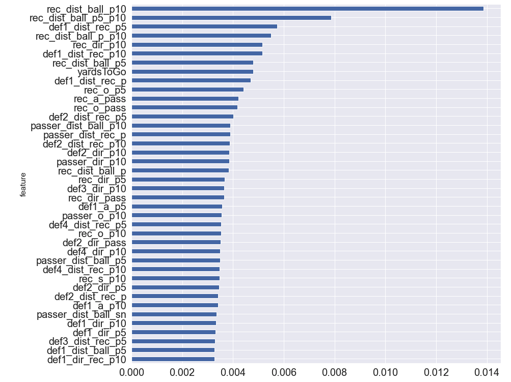

# README: James Gibbins DSI Capstone - V1.2

## INTRODUCTION / AIMS

Hello!

This project aims to use GPS tracking data of NFL players to predict the outcome of passing plays based on the movements of key players from the offensive and defensive teams.

The primary goal of the project is to classify whether a play will ultimately be successful for the offense or defense based on the relative movements of players a maximum of 1 second after the pass is thrown. The project hopes to glean useful insights from this time period to aid coaches analysis of plays and make recommendations for improvements on both the offensive and defensive side of the ball.

The project on this notebook uses data sourced from the 2021 NFL Big Data Bowl hosted by kaggle:
[Raw Data & Competition Info](https://www.kaggle.com/c/nfl-big-data-bowl-2021/overview)

### GLOSSARY OF TERMS (for the unfamiliar with NFL):

Field: The NFL field is 120 yards by 53.3 yards - with the 10 yards at each end being the scoring zones

Offense: the team which is attempting to progress the ball down the field and ultimately score

Defense: conversely the team attempting to prevent the offense from progressing

Line of Scrimmage: The imaginary line that represents the offense’s progress prior to the play, it is the line on which the ball is positioned at the start of each play.

Ball Snap: This is the first moment the play is live and the ball is moved by the offensive team

Pass Forward: On each play the offensive team is allowed to pass the ball forward only one time

QuarterBack (QB): The specialist passer - the player on each team who almost always passes the ball forward

Receiver (Rec): Each offense has a number of receivers who try to get open (in space away from the defenders) in order to catch a pass from the QB

Down: The offensive team has 4 attempts (or downs) to progress the ball 10 yards closer to the defending team’s end zone

## DATA:

The data provided is GPS tracking of players on passing plays. The data covers all 32 teams from the 17 weeks of the 2018 season. 

Each play is broken down in to frames of 0.1 second time increments. 

The tracking data includes x and y coordinates for each player relative to the field yardage (x= 0 - 120 , y = 0 - 53.3). Also speed, acceleration and distance measurements.

Data also includes player orientation and direction of travel as a bearing where 0 degrees is parallel to the y axis. 

## EDA & DATA CLEANING

[Notebook](https://github.com/jgibbins1990/DSI_Capstone/blob/main/DSI_Capstone_Code_EDA%26Cleaning.ipynb)

Data was provided in 20 csv files:
- Player Information (1 csv file)
- Game Information (1 csv file)
- Play Information (1 csv file)
- GPS Tracking Data (17 csv files)

The linked notebook shows data cleaning steps and EDA of the raw data. Some example EDA for the player information is shown below:

### SELECTING DATA FOR ANALYSIS

- We can see that the ball snap generally occurs after 11 frames (1.1 second). The snap is the first moment where the play is live.
- On average there is a pass forward made around 2.6 - 2.8 seconds after the snap
- On average passing outcomes occur 1.5 seconds after the pass is thrown
- For the analysis I used GPS data from 4 frames of each play. The Snap / Pass Forward / 0.5 seconds after pass / 1.0 seconds after pass.

## PLOTTING DATA:

[Notebook](DSI_Capstone_Code_Plotly_Viz.ipynb)

I plotted the data for each play using plotly express. This allowed me to clearly visually represent the players movements on the field of play and break down the plays for analysis.

An example play is shown below broken down into the 4 frames highlighted. 

#### Ball Snap - frame 11

In the above frame (11) we see the offensive (green) and defense (purple) lined up either side of the line of scrimmage.

#### Pass Forward - frame 36

In the above frame (36) we see the offense has moved the ball to the QB Matt Ryan. He will now attempt to pass the ball to one of the offensive receivers and the defensive players will attempt to prevent the pass being completed or block the progress of the receiver.

#### Pass Forward + 0.5 s - frame 41

In the above frame (41) the pass is made and the ball is travelling towards the intended receiver.

#### Pass Forward + 1 s - frame 46

In the above frame (46) the pass is made and the ball is travelling towards the intended receiver Julio Jones.

## FEATURE ENGINEERING / LABELLING:

[Notebook](DSI_Capstone_Code_Feature_Engineering.ipynb)

- Feature Engineering involved the labelling of certain players on the play , namely: Passer & Receiver for the offense and Defenders 1-5 for the defense
- Once labelled - I engineered features that relate each players movements with relation to the ball and receiver over the 4 frames
- In some cases I was unable to clearly identify the passing player - these plays were dropped
- For each play we have some descriptive information, and the tracking data of football, passer, receiver, 5 defenders plus engineered features to describe their movement realtive to each other
- After all data cleaning and feature engineering 15,511 plays will be modelled on 386 features (categorical variables still needing dummification)

## MODELLING:

[Notebook](DSI_Capstone_Code_Modelling.ipynb)

### Target Variable
- In order to assess the play I am using the EPA variable.
- Expected points is a metric that estimates the average of every next scoring outcome given the play's down, distance, yardline, and time remaining relative to the offensive team
- Due to the large number of outliers I am not doing a regression to try and predict the EPA for each play but rather have binarized the variable based on the median epa
- If the epa for a play is higher than the median I have classified it as a successful action for the offense, and conversely if the epa is below the median it will be succesful for the defense

### CLF Models

- A few of the top performing models are shown - all models have been run with a 5 fold cross validation to prevent the chances of over fitting
- A Gridsearch is shown for the Random Forest, improving CV score from 0.665 to 0.698
- Ultimately the best model was a bagging classifier on a Decision Tree with a 0.718 accuracy score vs 50% baseline
- The bagging model was slightly better at predicting for Offense vs Defense with F1 score 0.72 vs 0.71 and recall 0.74 vs 0.69 
- Area under Precision - Recall and ROC curves was almost identical for both classes
- Engineered features dominated the feature importance of the Random Forest model, with only YardsToGo featuring in top 40
- I extracted the highest featured defence teams and players. (passers dominated here - QBs)

## PREDICTIONS

[Notebook](DSI_Capstone_Code_Predictions.ipynb)

- So we have a model which can make a prediction with 72% accuracy - let's take a look at where the model failed and try to work out why

### PREDICTED FOR OFFENSE , ACTUAL EPA: -6.421602

- In the above play, the ball is passed forward and 1 second after (frame 50) the ball is well on the way to open receiver
- Receiver drops the ball and the resulting interception leads to the defensive team to pick up the ball and put the offense back 10 yards
- Model here doesn't have enough data at 1 second after the pass to make a good prediction

### PREDICTED FOR DEFENSE , ACTUAL EPA: 7.775187

- At the moment of pass (frame 40) the defense has really good cover of all receivers
- The pass is to open space dissecting a number of defenders
- Here the 3d nature of the play ('the ball is in the air') is not well represented and I believe the model does not predict a completed pass. Further the pass is not direct to the receiver but to open space and the receiver (Moncrief) has to move a large distance in order to catch the ball.

## CONCLUSIONS & NEXT STEPS:

- With machine learning modelling we are able to make a prediction on the outcome of a play with 72% accuracy using only 4 frames of tracking data per play, this has been achieved by engineering GPS tracking features based on the movements of defensive players in relation to the passer and receiver on the offense and the ball.

- Looking at feature importances of models we are able to say that our engineered features have the highest impact on the models and in particular the distances of receiver, ball and first defender at p5 and p10 have the greatest impact on the models. Clearly it is of great impirtance for the defense to identify and obstruct the receiver as soon as possible in the play.

- The data mapped players and the ball in 2 dimensions only and so struggled to deal with the 3D reality when the ball spent a long time in the air. Equally passes in to open space (not directed at a receiver) were not well handled.

- It would be possible in future to break down plays in to further subgroups based on these failing and attempt further model (e.g. modelling passes in to open space separately to see if there are different feature importances at play)

- It would be nice to have data referring to the path of the ball in the air (e.g. height, trajectory) as this may help deal with the failings of a 2D representation of the plays. (Though this may be hard to come by or impossible at present!)

## Thanks for reading!
